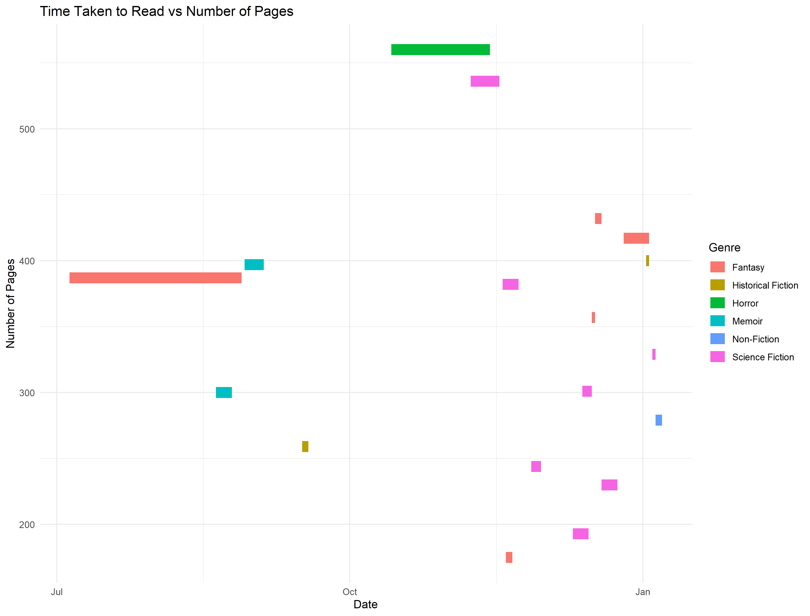
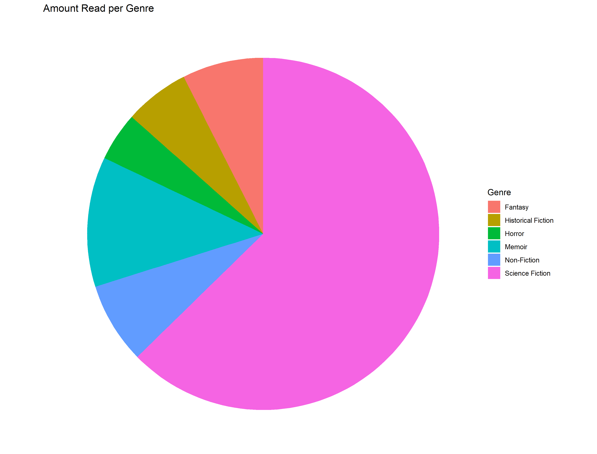
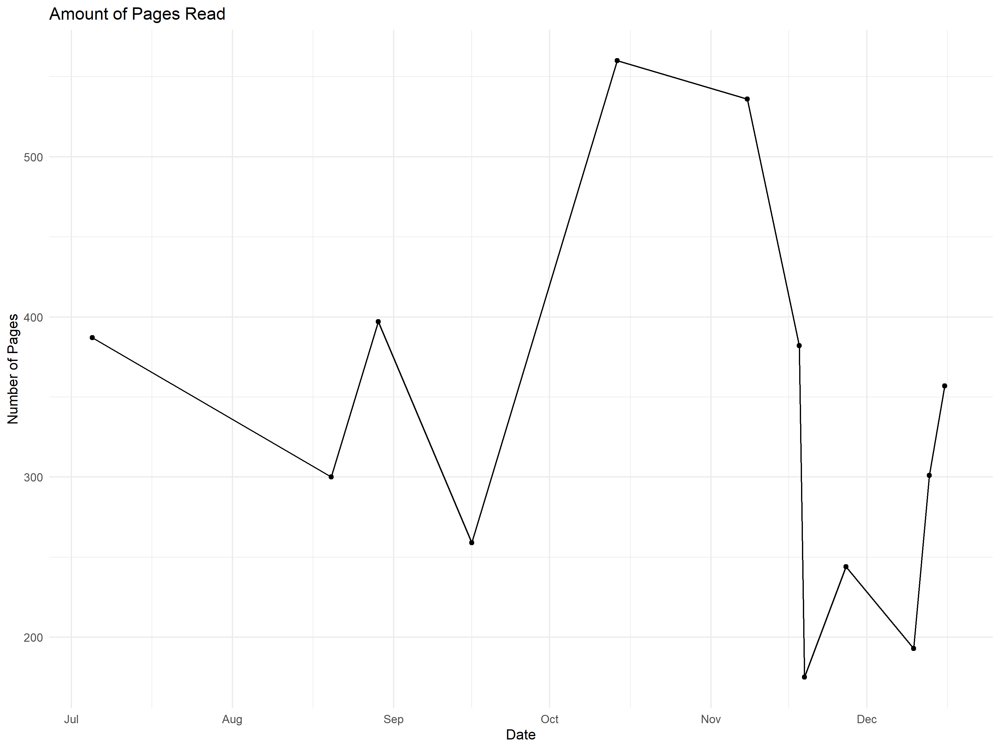
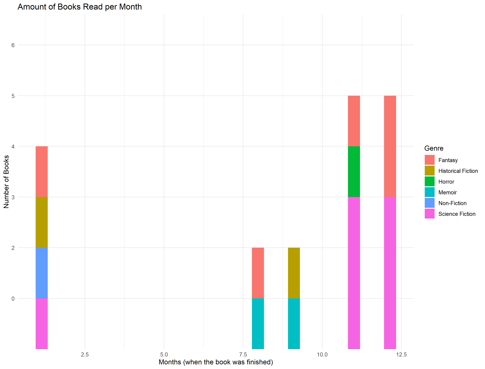

# Book Log #

    
    
    
    

## Methodology ##

I have always been interested in my reading habits especially how they relate to the genre I am reading. Using mongodb
and R I was able to visualize my reading habits for the last 6 months.

## Results ##

---

---

---

## Future Expansion ##

* Feature creation - create more interesting graphs with different feature
* Website - A place where people can put in their own reading habits to visualize
* Auto update - github checks every day if mongoDB has a new book, then updates visualizations 

## Resources Used ##

* <a herf="https://learn.mongodb.com/">https://learn.mongodb.com</a>