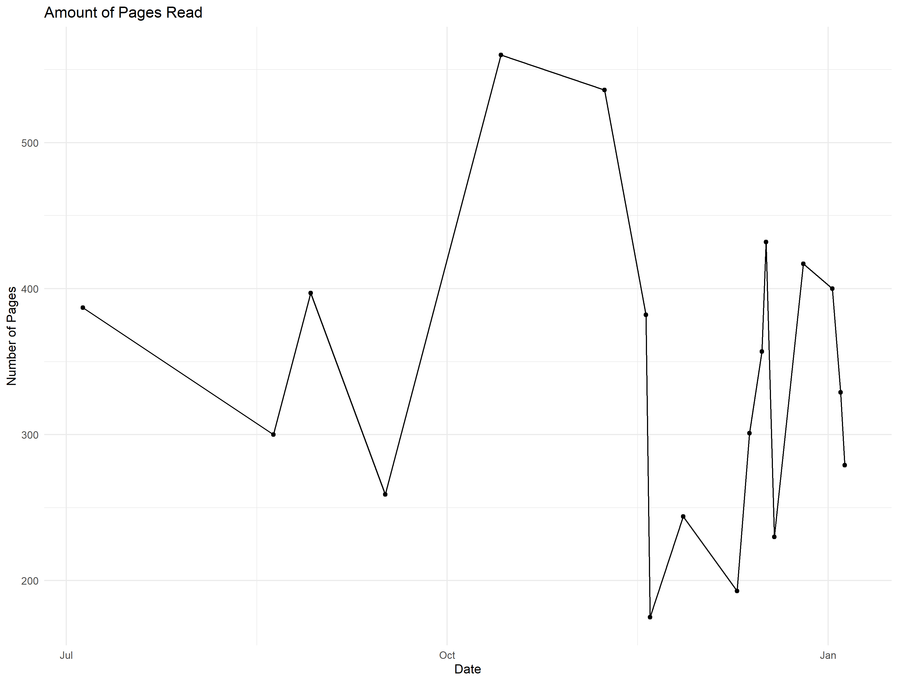

# Book Log #

    
    
    

## Methodology ##

I have recently been interested in my reading habits, especially as it relates to genre. I have been collecting data about my reading habits for the last six months and stored them on MongoDB. I used MongoDB instead of Mysql due to the flexibility that it can provide, especially if I want to add information about books later. As you can see below, I read mostly science fiction with some Fantasy. I will continue updating this visualization as I finish more books in 2023.

 - <a href="https://www.goodreads.com/user/show/80970586-jack-hangen">my Goodreads page</a>

## Results ##

---

---

---

## Future Expansion ##

* Feature creation - create more interesting graphs with different feature
* Website - A place where people can put in their own reading habits to visualize
* Auto update - github checks every day if mongoDB has a new book, then updates visualizations 

## Resources Used ##

* <a herf="https://learn.mongodb.com/">https://learn.mongodb.com</a>
